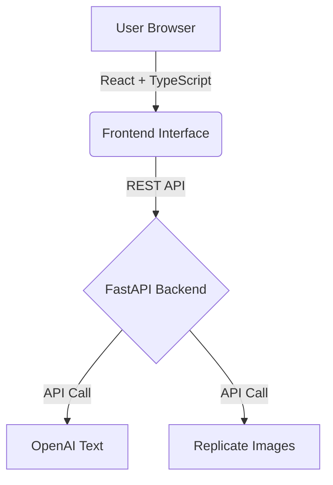

Here is the complete `README.md` file content in a single code block, ready to copy and paste.

```markdown
# 🔍 PromptLens: Making Generative AI Explain Itself

> **Final Year Research Project** > **Author:** Sudharshan Ravichandran  
> **Institution:** Indian Institute of Technology (IIT)  
> **Year:** 2024–2025

---

## 🧠 Overview

**PromptLens** is a research-focused prototype that explores **explainability in generative AI systems**.

While modern AI models can generate high-quality text and images, they rarely explain *why* a specific output was produced. This lack of transparency affects user trust, control, and effective use.

PromptLens introduces an interactive interface that breaks user prompts into semantic segments and visually links these segments to generated outputs. The goal is not to expose internal model reasoning, but to study whether **perceived transparency** improves user understanding and trust.

---

## 🎯 Research Goals

- **Investigate** explainability techniques for black-box generative AI models.
- **Visualise** how different prompt segments influence outputs.
- **Support** prompt experimentation through *what-if* analysis.
- **Measure** user trust and perceived understanding.
- **Provide** a reusable platform for XAI and HCI research.

---

## 🔬 Research Context

PromptLens is designed as a **black-box explainability system**.

- **No access** to internal model weights or attention maps.
- Explanations are **proxy-based and heuristic**.
- Focus is on **user perception**, not ground-truth causality.

This approach reflects real-world constraints when working with closed-source commercial APIs such as OpenAI and Replicate.

---

## ✨ Key Features

### 🧩 Prompt Segmentation
- Automatic decomposition of prompts into semantic units.
- Categories include: *Subject, Style, Context, Action, and Modifiers*.
- Segments can be edited, removed, or reclassified interactively.

### 📄 Explainable Text Generation
- Sentence-level attribution to prompt segments.
- Visual contribution indicators.
- Interactive highlighting between input and output.

### 🖼 Explainable Image Generation
- Prompt-to-image influence mapping.
- Approximate region-based explanations.
- Focus on interpretability rather than pixel-level accuracy.

### 🔄 What-If Analysis
- Compare original and modified prompts side by side.
- Observe output changes and influence shifts.

### 📊 Trust & Feedback Metrics
- User-rated understandability and usefulness.
- Confidence scoring.
- Session-based anonymous analytics.

---

## 🏗 System Architecture



---

## 🛠 Technology Stack

### Frontend

* React
* TypeScript
* Vite
* Tailwind CSS

### Backend

* Python 3.10+
* FastAPI
* Pydantic
* spaCy
* OpenAI API
* Replicate API

---

## 🚀 Running the Project Locally

### Prerequisites

* Node.js 18+
* Python 3.10+
* Git

### 1. Frontend Setup

```bash
# Navigate to project folder
cd promptlens/src

# Install dependencies
npm install

# Run development server
npm run dev
# The app will run at http://localhost:5173

```

### 2. Backend Setup

```bash
cd backend

# Create virtual environment
python -m venv venv

# Activate virtual environment
# Windows:
venv\Scripts\activate
# Mac/Linux:
# source venv/bin/activate

# Install requirements
pip install -r requirements.txt

# Download NLP model for segmentation
python -m spacy download en_core_web_sm

# Run the server
uvicorn app:app --reload --port 8000
# The API will run at http://localhost:8000

```

### 3. Environment Variables (`.env`)

Create a `.env` file in the `backend/` directory with the following keys:

```env
OPENAI_API_KEY=your_openai_api_key
REPLICATE_API_TOKEN=your_replicate_api_token
CORS_ORIGINS=http://localhost:5173,http://localhost:3000

```

---

## ⚠️ Explainability Disclaimer

> **PromptLens does not provide true model explainability.**

* All explanations are **approximations**.
* Contribution scores are **heuristic**.
* Image attention maps are **simulated**.

This is intentional and aligned with applied XAI research on closed-source AI systems.

---

## 🧪 Limitations

* Black-box API dependency.
* English-only NLP pipeline.
* Heuristic segmentation.
* No long-term data persistence.

---

## 📁 Project Structure

```text
promptlens/
├── src/            # React frontend
├── backend/        # FastAPI backend
├── public/         # Static assets
├── README.md       # Project documentation
└── ...

```

---

## 👤 Author

**Sudharshan Ravichandran** Final Year Undergraduate

Informatics Institute of Technology

---

## 📜 License

**MIT License** For academic and research use.

```

```